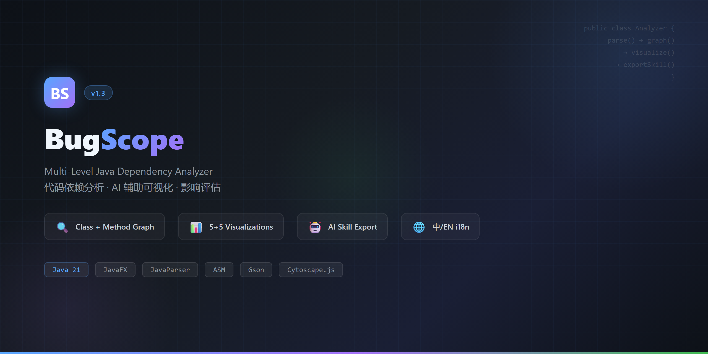



# BugScope - Code Dependency Analyzer / 代码依赖分析器

> 🚀 A JavaFX desktop tool for scanning Java projects, building multi-level dependency graphs, and generating AI-assisted interactive visualizations.
> 🚀 一款 JavaFX 桌面工具，用于扫描 Java 项目、构建多层级依赖图，并生成 AI 辅助的交互式可视化图表。

## ✨ Features / 功能特性

### Core / 核心功能
- **Project Scanner / 项目扫描** — Recursively parses Java source files using JavaParser + ASM bytecode analysis / 递归解析 Java 源文件
- **Class Dependency Graph / 类级依赖图** — Directed graph of class relationships (fields, params, locals, imports, inheritance) / 类关系有向图
- **Method-Level Graph / 方法级依赖图** — Extracts method calls, field accesses via ASM visitor / 基于 ASM 提取方法调用与字段访问
- **Search & Query / 搜索查询** — Search classes by name, view class details (fields, methods) / 按名称搜索类，查看详情
- **Impact Analysis / 影响分析** — Analyze which classes are affected when a given class changes / 分析修改某个类会影响哪些其他类
- **Skill Export / Skill 导出** — Generate `.codeskill/` directory with `dependency_graph.json`, `impact_analysis.txt`, `ai_context.json` / 生成含依赖图、影响分析、AI 上下文的 Skill 文件
- **File Watcher / 文件监听** — Auto-monitor file changes with toggle on/off / 可开关的自动文件变更监听
- **AI-Assisted / AI 辅助** — Integrated AI-powered visualization generation and context export / 集成 AI 辅助可视化生成与上下文导出

### 5 Class-Level Visualizations / 5 种类级可视化
- **Force-Directed Graph / 力导向图** — Interactive Cytoscape.js web, drag/zoom/click-highlight / 交互式蜘蛛网图
- **Sunburst Chart / 旭日图** — Hierarchical package/class dependency view / 分层包/类依赖视图
- **Heatmap / 热力图** — Dependency density matrix / 依赖密度矩阵
- **Chord Diagram / 和弦图** — Cross-class dependency flow / 跨类依赖流向
- **Hierarchical Tree / 层级树** — Layered dependency tree / 分层依赖树

### 5 Method-Level Analyses / 5 种方法级分析
- **Call Tree / 调用树** — Depth-limited call tree (SVG/Canvas) / 可调深度的调用树
- **Impact Analysis / 影响范围** — What methods are impacted by changes / 变更影响的方法
- **Dependency Graph / 方法依赖图** — Full method-to-method network / 完整方法间网络
- **Cycle Detection / 循环检测** — Detect circular method calls / 检测循环调用
- **Complexity Analysis / 复杂度分析** — Method complexity metrics / 方法复杂度指标
- **Field Access Tracking / 字段访问追踪** — Track field read/write across methods / 追踪字段读写

### UI / 界面
- JavaFX native desktop app, resizable window / JavaFX 原生桌面，可调整大小
- **Settings / 设置**: Theme (Light/Dark) + Language (English/简体中文) — both fully working / 主题+语言切换均已完善
- Window size persistence / 窗口尺寸记忆
- Settings persistence across sessions / 设置跨会话持久化

## 🛠 Tech Stack / 技术栈

| Component | Technology | Version |
|-----------|-----------|---------|
| Language / 语言 | Java | 21 |
| UI Framework | JavaFX (OpenJFX) | 21.0.2 |
| Source Parsing | JavaParser | 3.25.1 |
| Bytecode Analysis | ASM | 9.6 |
| JSON | Gson | 2.10.1 |
| Visualization | Cytoscape.js / Canvas / SVG | CDN |
| Build | Maven + jpackage | — |
| Logging | SLF4J | 2.0.7 |

## 📁 Project Structure / 项目结构

```
src/main/java/com/analyzer/
├── Main.java
├── controller/
│   ├── MainController.java       # Primary UI + all feature orchestration
│   └── SettingsController.java   # Theme/Language/Auto settings
├── model/                        # ClassNode, DependencyEdge, MethodNode, etc.
├── parser/
│   ├── JavaCodeParser.java       # JavaParser source scanner
│   ├── MethodDependencyExtractor.java
│   └── MethodDependencyVisitor.java  # ASM bytecode visitor
├── graph/
│   ├── DependencyGraph.java      # Class-level directed graph
│   └── MethodGraph.java          # Method-level directed graph
├── ui/
│   └── GraphVisualizer.java      # Cytoscape.js HTML generator
├── util/
│   ├── Config.java               # Persistent config
│   ├── ThemeManager.java         # Light/Dark themes
│   ├── LanguageManager.java      # i18n (50+ keys, 中/EN)
│   ├── VisualizationManager.java
│   ├── MethodVisualizationManager.java
│   └── UltraClearMethodVisualizationManager.java
├── monitor/
│   └── FileChangeMonitor.java
├── skill/
│   └── SkillGenerator.java       # .codeskill exporter
└── visualization/engine/
    └── SuperClearLayoutEngine.java
```

## 🔧 Build & Run / 构建与运行

```bash
# Compile
mvn clean package -DskipTests

# Run JAR
java -jar target/code-dependency-analyzer-1.0.0.jar

# Package as EXE (Windows)
jlink --module-path %JAVAFX_HOME%/lib --add-modules javafx.controls,javafx.fxml,javafx.web --output fx-jre
jpackage --type app-image --name CodeDependencyAnalyzer --input target --main-jar code-dependency-analyzer-1.0.0.jar --dest dist --runtime-image fx-jre
```

## ⚠️ Known Issues / 已知问题

### Visualization / 可视化
- **Sunburst / 旭日图**: Deep package hierarchies may cause label overlap / 深层包可能导致标签重叠
- **Heatmap / 热力图**: Cell sizes may be slightly uneven under certain data distributions / 特定数据下格子大小可能不够均匀
- **Force Graph / 力导向图**: Very dense graphs can cause node clustering at small zoom / 极密图在缩小时节点可能聚集
- **Long Names / 长名称**: Very long class names may be truncated in graph nodes / 极长类名可能被截断

### Method Analysis / 方法分析
- Method descriptor resolution via ASM is basic — complex generics and overloaded methods may produce incomplete matches / 方法描述符解析较基础，复杂泛型和重载方法可能匹配不完整

### EXE Deployment / EXE 部署
- The native EXE expects `CodeDependencyAnalyzer.cfg` in its directory; moving the app folder without updating paths may cause startup errors / 原生 EXE 依赖目录下的 .cfg，移动目录可能导致启动报错

## 📝 Notes / 说明
- i18n coverage: ~50+ keys across all menus, buttons, tabs, dialogs, and status labels / 覆盖全部菜单、按钮、标签页、对话框和状态标签
- Settings (theme, language, paths) persist across sessions via config file / 设置通过配置文件跨会话持久化
- Skill export generates 3 files: `dependency_graph.json`, `impact_analysis.txt`, `ai_context.json` / Skill 导出生成 3 个文件

## 📄 License / 许可证
MIT

